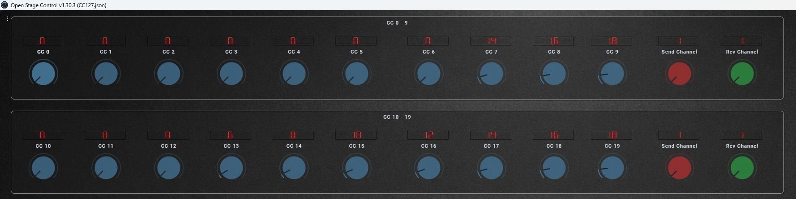
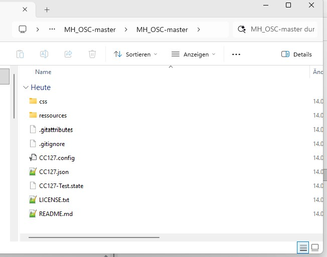
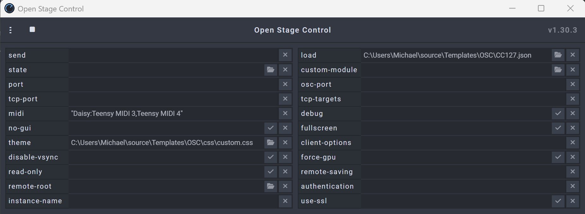
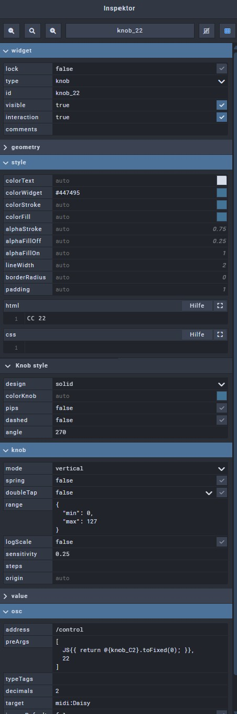

# Open Stage Control MIDI CC Template

A configurable MIDI CC controller template for  
https://openstagecontrol.ammd.net

This project provides a ready-to-use Open Stage Control setup with 70 MIDI CC knobs for controlling hardware or software MIDI devices.

Perfect for:
- DIY DSP projects
- Daisy Seed / Teensy controllers
- Guitar FX processors
- Synthesizers
- MIDI-controlled plugins
- Live performance rigs



---

# Features

- 70 MIDI CC knobs
- 7 panels with 10 knobs each
- Individual MIDI channel per panel
- CC range 0–127
- Designed as a clean starting template for custom controllers
- Works great with embedded DSP platforms like:
  - Daisy Seed
  - Teensy

---

# Per-Panel MIDI Channel

Each panel contains a **red knob** used to select the MIDI transmit channel (1–16).

All CC messages from that panel are sent on the selected channel.

---

# Dynamic MIDI Receive Channel Switching

Each panel also contains a **green knob**.

This knob sends:
- CC 102
- on the panel's current MIDI channel

The transmitted value tells a compatible device which MIDI channel it should listen to in the future.

⚠️ This is a custom feature implemented only in some of my own devices.  
Most users will not need it and can safely delete the green knob.

---

# Example Workflow

Imagine your DSP currently listens on MIDI channel 6:

1. Set the red knob (send channel) to channel 6
2. Set the green knob to channel 8
3. The DSP switches its receive channel to 8
4. Now also set the red knob to 8

Done.

---

# Installation

## Download

Download this repository as ZIP and extract it.

You should get something like this:



---

# Open Stage Control Configuration

Inside Open Stage Control:

## Theme
Load:

```text
css/custom.css
```

into the **Theme** field.

## Session
Load:

```text
CC127.json
```

into the **Load** field.



---

# Customization

For general Open Stage Control editing, see the official documentation:

https://openstagecontrol.ammd.net/docs/getting-started/introduction/

Basic workflow:

1. Open Edit Mode (`CTRL + E`)
2. Remove unused panels
3. Remove unused knobs and value displays
4. Delete the green receive-channel knob if not needed

---

# Knob Configuration

A knob is mainly configured in three places inside the OSC inspector.

## `html`
The visible label/title of the knob.

---

## `range`
Defines the value range.

Example:

```json
{
  "min": 0,
  "max": 127
}
```

This sends standard MIDI CC values from 0–127.

---

## `preArgs`
Defines the MIDI CC number.

The second value in the array is the CC number.

Example:

```json
[
  JS{{ return @{knob_C2}.toFixed(0); }},
  22
]
```

In this example the knob sends:

```text
MIDI CC 22
```



---

# Intended Usage

This template was created mainly for controlling custom embedded DSP systems such as:

- Daisy Seed guitar processors
- Teensy audio projects
- MIDI-controlled analog gear
- Experimental DSP prototypes

It is intentionally simple and easy to modify.

---

# License

Free to use, modify and extend.
